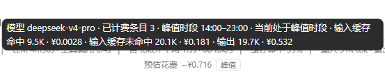
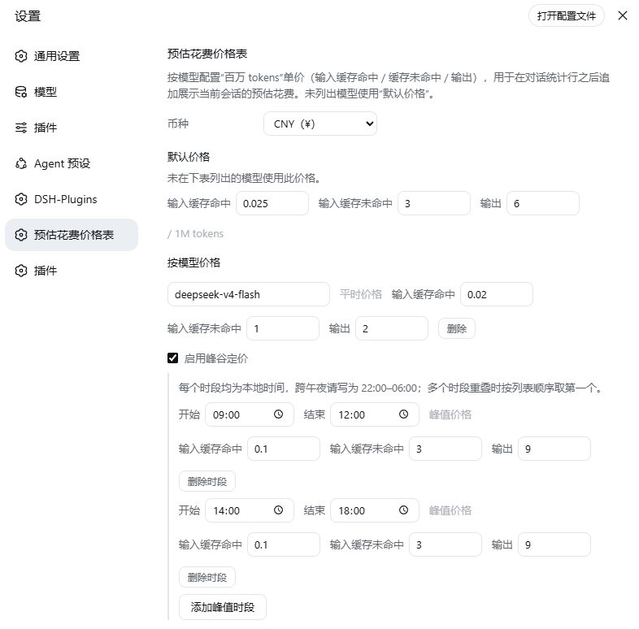

# dsh-cost-meter


*既然都知道输入输出的token数目了，为什么不自动计算价格呢？*

DeepSeek Harness（DSH）Web 插件：在对话统计行（缓存命中率 / 输入 / 输出）之后追加展示当前会话的**累计花费**，并提供可在设置页中编辑的按模型价格表（支持峰谷定价）。

价格单位为所选币种（CNY / USD）下**每 1,000,000 tokens** 的单价，支持三种计费项：

| 计费项 | 统计来源（`tokenUsage` 投影） |
|---|---|
| 输入缓存命中 | `cacheReadTokens` |
| 输入缓存未命中 | `uncachedInputTokens + cacheWriteTokens` |
| 输出 | `outputTokens` |

每轮费用 =（缓存命中 × 命中价 + 缓存未命中 × 未命中价 + 输出 × 输出价）/ 1,000,000。
每轮按该轮发生时的模型与峰谷时段**独立计价并存为一条不可变条目**，会话展示的累计花费为所有条目之和。

## 峰谷定价

每个模型可以启用任意数量的峰值时段，每个时段自带三档单价：

- 时段使用本地时间 `HH:mm`，`start > end` 表示跨午夜（如 `22:00`–`06:00`）；
- 命中任一时段即按该时段价格计费，并给该轮条目打上时段标记；
- 多个时段重叠时按列表顺序取第一个；
- 当前会话所选模型正处于峰值时段时，花费行会显示「峰值」提醒，悬停可见时段与分项明细。

## 费用条目与归档

- 费用条目保存在 DSH 自有 storage-domain 侧车表（`dsh-cost-meter` domain，`sessions` 表），按会话隔离，不写入 `settings.yaml`；
- 条目保存**该轮当时的价格快照**（模型、峰谷时段、三档单价、币种、token 与金额），之后修改价格表只影响新轮次；
- 归档会话时自动删除该会话的费用条目（30 秒内完成清理，读取时也会即时校验）；
- **升级本版本前的历史轮次不会回溯生成条目**，升级后的新轮次才开始累计；
- 已有费用条目后不可切换币种，避免新旧币种条目无法合并加总。

## 默认价格

首次安装时预置 CNY 价格表如下（1M tokens，峰谷定价默认关闭）：

| 模型 | 输入缓存命中 | 输入缓存未命中 | 输出 |
|---|---:|---:|---:|
| `deepseek-v4-flash` | ¥0.02 | ¥1 | ¥2 |
| `deepseek-v4-pro` | ¥0.025 | ¥3 | ¥6 |
| 默认价格（未匹配模型） | ¥0.025 | ¥3 | ¥6 |

## 功能

- **底部统计行追加累计花费**：注册到 `conversation.composer.dock`，随会话切换与新一轮计费自动刷新；悬停显示模型、已计费轮次、峰谷时段与各分项明细；
- **按模型价格表**：设置页新增「预估花费价格表」，可配置币种、默认价格、任意数量模型的三档平时单价；
- **峰谷分支**：每个模型可增删多个峰值时段，并为每个时段单独配置三档价格；
- **逐轮独立记账**：每轮按发生时间与价格快照独立保存，归档会话即删除条目，不长期占用存储；
- **本地持久化**：价格配置保存在 `$DSH_HOME/settings.yaml` 的 `dsh-cost-meter:` 段，保存后即生效；
- **中英双语**：随界面语言切换（`zh` / `en`）。

## 效果




## 使用

安装并重启服务端后：

1. 打开 **设置 → 预估花费价格表**，修改币种、默认价格或按模型价格；
2. 勾选某模型的「峰谷定价」并添加时段、设置峰时价格；
3. 点击 **保存**；之后的新轮次按新价格表逐轮记账；
4. 点击 **恢复默认** 可清空用户价格配置，回到上表的出厂价格。

无可用用量、无已计费条目、或价格表尚未加载时，花费行自动隐藏，不占用布局。

## 安装

在 harness 目录中把本插件加入 `web` profile：

```powershell
cd <harness 目录>
# 本地源码（link 方式）
dsh plugin --profile web add "link:<dsh-cost-meter 目录>"
# 发布到 registry 后
dsh plugin --profile web add dsh-cost-meter
```

或者直接在 `.dsh\profiles\web\node_modules` 下运行：

```
git clone git@github.com:Creakono/dsh-cost-meter.git
```

随后重启 web 服务端，刷新页面即可。
如果通过 pnpm 脚本启动 harness，插件命令同样写为 `pnpm dsh plugin ...`。

## 构建

源码开发时可重新构建插件产物：

```powershell
cd dsh-cost-meter
pnpm install
pnpm run build
```

构建输出：

- Host 端 `index.mjs`：价格表设置命名空间、逐轮费用侧车表、归档清理与自有配置/账本路由（schemastery 已内联）；
- 浏览器端 `client.js`：累计花费行（含峰值提醒）+ 价格表设置页。

## 配置结构

`$DSH_HOME/settings.yaml` 中的用户价格配置结构：

```yaml
dsh-cost-meter:
  currency: CNY          # CNY 或 USD
  default:               # 未匹配模型的兜底价格
    cacheHitPrice: 0.025
    cacheMissPrice: 3
    outputPrice: 6
    peakWindows: []
  models:                # 按模型覆盖
    deepseek-v4-flash:
      cacheHitPrice: 0.02
      cacheMissPrice: 1
      outputPrice: 2
      peakWindows:       # 可多个；start > end 表示跨午夜
        - id: peak-9
          start: 09:00
          end: 12:00
          cacheHitPrice: 0.1
          cacheMissPrice: 3
          outputPrice: 9
```

schema 默认值只在用户未写入 `models` 时生效，因此把 `models` 清空后保存即可真正移除全部模型条目。

## 实现说明

- 用量直接读取 token-meter 的 `tokenUsage` 会话投影，与内置统计行同源：分页与压缩（compaction）都不影响数字；
- 每轮费用由 Host 端监听 `session/event`，在 usage 事件落盘时按当时配置生成条目并写入 storage-domain，客户端只做条目求和；
- 当前模型取自 `ctx.modelDirectories`（可选服务），缺失时回退到「默认价格」档；
- Web api-proxy 只向浏览器暴露白名单内的设置命名空间，因此价格表与账本通过插件自有同源路由读写：
  `GET /dsh-cost-meter/config`、`POST /dsh-cost-meter/config`（整段写入）、
  `POST /dsh-cost-meter/reset`（恢复默认）、
  `GET /dsh-cost-meter/sessions/:sessionId/ledger`（会话条目汇总）；
- v1 的扁平价格配置（`currency` + 三个顶层单价）会在读取时自动折叠进 `default` 档。

## 该项目为纯粹Vibe coding，对代码健壮性不做保证！
